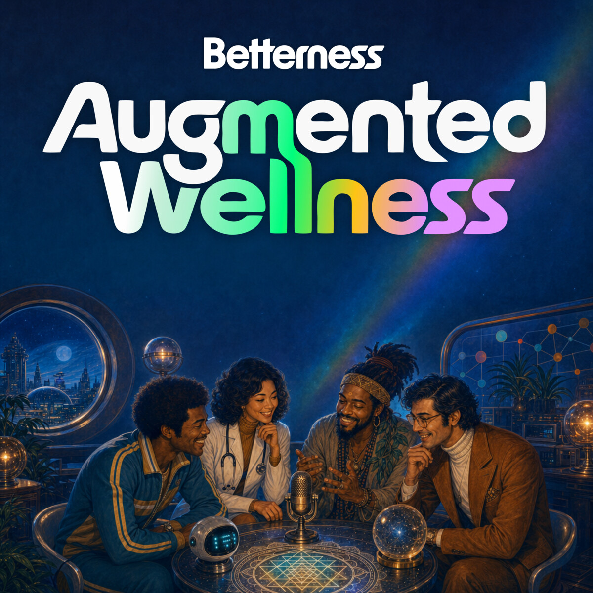

# Augmented Wellness

**Where we meet the people in pursuit of better.**

---

## This is not a podcast.

It's a build log. Every episode pairs a real builder — founders, doctors, healers, coaches, operators — with a piece of **actionable code you can fork** and vibe-code into your own thing: a starter kit, a prompt set, an agent you can stand up.

You don't just listen. You leave with something you can run.

## Episodes

| # | Guest | Artifact | Watch / Listen |
|---|-------|----------|----------------|
| **001** | **Martin Varsavsky** — building an AI that aims to pass the FDA, and *"Pedro,"* his disclosed AI agent that posts in his own voice on X | **[`better-x`](./episodes/001-martin-varsavsky/better-x)** — build your own guarded, disclosed X agent | [YouTube](https://youtu.be/l2tLdSlamIc) · [Apple](https://podcasts.apple.com/podcast/id1896935053) · [Spotify](https://open.spotify.com/show/033zAkDQc1NpADnqP4OFzh) · [page](https://betterness.ai/augmentedwellness/001-martin-varsavsky) |
| 002 | *coming soon* | | |

## Start with Episode 001's artifact: `better-x`

Martin built *"Pedro"* — an AI trained on his own voice that posts to X, where two models must agree before anything goes out. **[`better-x`](./episodes/001-martin-varsavsky/better-x)** is the open starter kit to build your own:

- **Autonomy OFF by default** — nothing posts without you.
- **A review queue** — every draft waits for your approval.
- **A two-model publication gate** — a writer and an adversarial reviewer have to agree, or it doesn't go out.

Fork it, drop in your own identity and sources, and run it behind the action gate. → **[episodes/001-martin-varsavsky/better-x](./episodes/001-martin-varsavsky/better-x)**

## How it works

1. **Fork** this repo.
2. **Open the episode's artifact** (e.g. [`episodes/001-martin-varsavsky/better-x`](./episodes/001-martin-varsavsky/better-x)).
3. **Fill in the blank vault** with your own identity, topic, and sources — every template ships empty.
4. **Run it behind the action gate** — autonomy off, review queue on — until you trust it.

---

### About the show

Hosted by **Demian Bellumio** — co-founder and co-CEO of Betterness, longtime Miami tech entrepreneur — who has built across applied AI (his field is graph computing), media, telemedicine, and mental health. On Augmented Wellness he interviews from the inside: a builder comparing notes with the founders, healers, coaches, and operators on a mission to make the world better.

Produced by Demian Bellumio with the support of agents from Betterness One — the agentic studio inside Betterness.

Nothing here is medical advice. Opinions belong to our guests. · *Intelligence in pursuit of better.*
