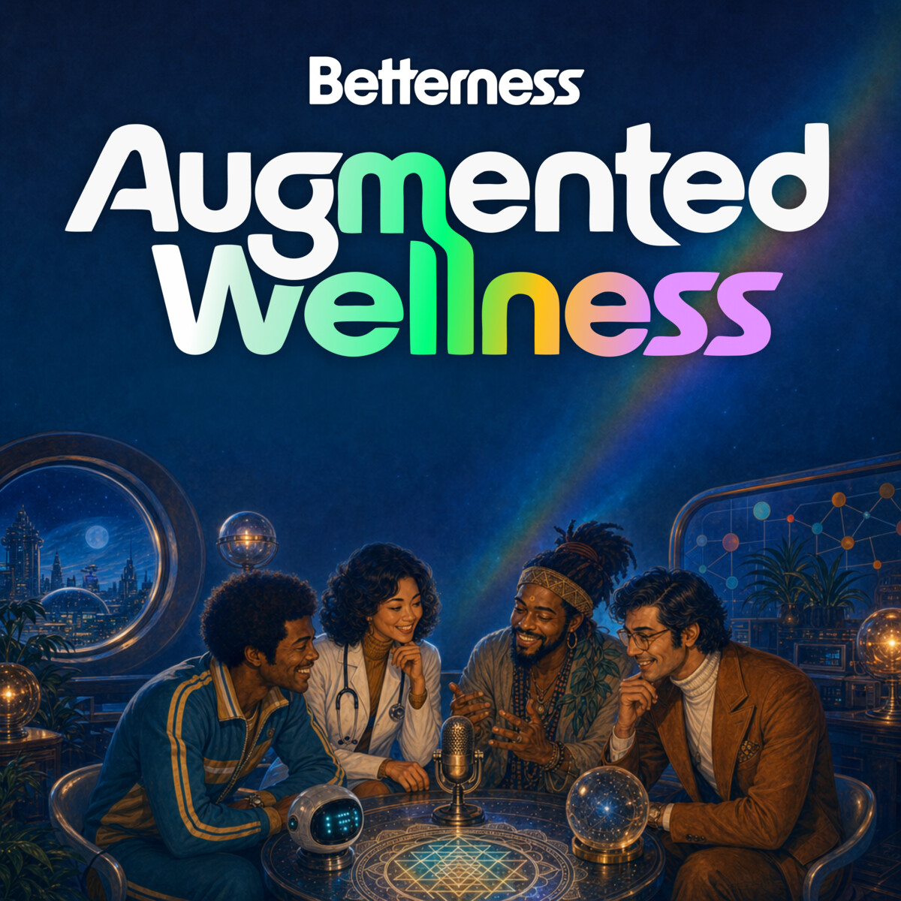

# Augmented Wellness

**Where we meet the people in pursuit of better.**

---

## This is not a podcast.

It's a build log.

Every episode pairs a real builder — founders, doctors, healers, coaches, operators — with the **things we actually build on the show**: AI interviewers, starter kits, prompts, source maps, claim notes, and agent-readable companion files. This repo is the lab where those artifacts live. You don't just listen — you leave with something you can open, read, fork, and make your own.

The recurring idea is simple: create your own AI interviewer. Start with markdown files that help an assistant understand who you are, what you want, what data matters, and what questions are worth asking. Use them with Claude, ChatGPT, Codex, a local agent, or any LLM that can read Markdown. Serve them through MCP if you want tools to read the context automatically. Connect Betterness when you want that static portfolio to come alive with permissioned wearables, labs, reports, goals, and lifestyle data.

To keep the promise honest, every artifact is a **starter system**, not a finished medical, coaching, or publishing product. Some artifacts are code kits. Some are structured context portfolios. Some are agent prompts. Anything that touches the outside world — live posting, credentials, health decisions, clinical interpretation — stays opt-in, disclosed, and bounded by the guardrails in the episode folder.

---

## What lives where

Augmented Wellness has two homes. Keep them straight and everything else makes sense.

### What lives on the website — [betterness.ai/augmentedwellness](https://betterness.ai/augmentedwellness)

The polished hub. The place to **discover and watch**:

- Episode pages, video, and audio.
- Show notes, guest bios, and the story.
- Links out to every platform.

If you want to *experience* an episode, start there.

### What lives in this repo — the lab

The hands-on companion. The place to go **after** an episode, to **try / fork / inspect / build**:

- **Starter kits** — the forkable artifact from each episode (e.g. `better-x`).
- **AI interviewers** — markdown portfolios and interviewer prompts that help an assistant understand the person before it reacts to disconnected data.
- **Prompts** — the actual prompt flows the artifact runs.
- **Source maps** — how an artifact reads from your own context, with empty templates.
- **Claim notes** — what an episode asserts, and where it's grounded vs. paraphrased.
- **Agent-readable companion files** — so a coding agent can pick up an artifact and run it without a human re-explaining everything.

> This repo is **not** the marketing site. It's the workshop floor.

---

## Episodes

| # | Guest | Artifact | Episode folder | Watch / Listen |
|---|-------|----------|----------------|----------------|
| **001** | **Martin Varsavsky** — building Certuma, an AI physician whose *goal* is to pass the FDA (a doctor stays in the loop; it is **not approved today**), and *"Pedro,"* his **disclosed** AI agent that posts in his own voice on X, where two models must agree before anything goes out | **[`better-x`](./episodes/001-martin-varsavsky/better-x)** — a starter kit for a guarded, disclosed X agent | [episodes/001-martin-varsavsky](./episodes/001-martin-varsavsky) | [YouTube](https://youtu.be/l2tLdSlamIc) · [Apple](https://podcasts.apple.com/podcast/id1896935053) · [Spotify](https://open.spotify.com/show/033zAkDQc1NpADnqP4OFzh) · [Amazon](https://music.amazon.com/podcasts/d3fcfba2-fded-460f-b818-1937d04d47db/augmented-wellness) · [page](https://betterness.ai/augmentedwellness/001-martin-varsavsky) |
| **002** | **Ulisses Abbud** — former professional cyclist, high-performance coach, and physiology researcher on why recovery is not the reward after performance, but the adaptation mechanism that makes performance possible | **[Create your own Cycling + Recovery AI Interviewer](./episodes/002-ulisses-abbud/context-portfolio)** — episode-specific markdown files and an interviewer prompt that help a rider explain training, recovery, HRV, sleep, stress, goals, and coach questions before connecting data through Betterness | [episodes/002-ulisses-abbud](./episodes/002-ulisses-abbud) | [YouTube](https://youtu.be/VA88-501Zvc) · [Apple](https://podcasts.apple.com/podcast/id1896935053) · [Spotify](https://open.spotify.com/show/033zAkDQc1NpADnqP4OFzh) · [Amazon](https://music.amazon.com/podcasts/d3fcfba2-fded-460f-b818-1937d04d47db/augmented-wellness) · [page](https://betterness.ai/augmentedwellness/002-ulisses-abbud) |
| **003** | **Dr. Lloyd Camper** — sports medicine physician and longevity specialist on why most people wait for the warning light, and how labs, DEXA, VO2 max, recovery, and realistic habits become a smarter healthspan baseline | **[Create your own Healthspan AI Interviewer](./episodes/003-lloyd-camper/context-portfolio)** — episode-specific markdown files and an interviewer prompt that help a person organize labs, DEXA, VO2 max, habits, risk, missing data, and clinician questions before connecting data through Betterness | [episodes/003-lloyd-camper](./episodes/003-lloyd-camper) | [YouTube](https://youtu.be/mhwS64sFqvc) · [Apple](https://podcasts.apple.com/podcast/id1896935053) · [Spotify](https://open.spotify.com/show/033zAkDQc1NpADnqP4OFzh) · [Amazon](https://music.amazon.com/podcasts/d3fcfba2-fded-460f-b818-1937d04d47db/augmented-wellness) · [page](https://betterness.ai/augmentedwellness/003-lloyd-camper) |
| **004** | **Dr. Rabin Rahmani** — gastroenterologist and practice builder on wartime resilience, colon-cancer prevention, individualized digestive care, and where AI can give physicians time back | **[Create your own Digestive Health Context Interviewer](./episodes/004-rabin-rahmani/artifact.md)** — a progressive interview and living Markdown portfolio for organizing symptoms, food patterns, medications, tests, procedures, missing evidence, and clinician questions | [episodes/004-rabin-rahmani](./episodes/004-rabin-rahmani) | [YouTube](https://youtu.be/VwT8qON9x1Y) · [Transistor](https://share.transistor.fm/s/204300c6) · [Apple](https://podcasts.apple.com/us/podcast/dr-rabin-rahmani-from-wartime-iran-to-brooklyn-and/id1896935053?i=1000777799367) · [Spotify](https://open.spotify.com/episode/0WLfczAnkncrxO67GZndC2) · [Amazon](https://music.amazon.com/podcasts/d3fcfba2-fded-460f-b818-1937d04d47db/augmented-wellness) · [page](https://betterness.ai/augmentedwellness/004-rabin-rahmani) |
| **005** | **Dr. Stephen Nimer** — physician-scientist and director of Sylvester Comprehensive Cancer Center on cancer research, survivorship, AI-assisted drug discovery, the Dolphins Cancer Challenge, and why medicine still begins with listening | **[Explore the DCC Research Navigator](./episodes/005-stephen-nimer/dcc-research-navigator)** — a source-grounded map of the researchers, cancer areas, programs, and public evidence highlighted through Faces of the DCC | [episodes/005-stephen-nimer](./episodes/005-stephen-nimer) | [YouTube](https://youtu.be/ctFSn2-4hL4) · [Podcast](https://share.transistor.fm/s/2b5debd5) · [Episode page](https://betterness.ai/augmentedwellness/005-stephen-nimer) |
| **006** | **Eduardo della Maggiora** — founder and CEO of Betterfly on leaving investment banking, rebuilding himself through Ironman, leading a social unicorn, and using a local AI agent to learn from twelve years of personal data | **[Build your Ironman Brain](./episodes/006-eduardo-della-maggiora/ironman-brain)** — an Obsidian-first personal performance system that combines goals and lived context with permissioned workouts, wearables, sleep, body composition, biomarkers, and labs through the Betterness MCP | [episodes/006-eduardo-della-maggiora](./episodes/006-eduardo-della-maggiora) | [YouTube](https://youtu.be/HTHKB1OriXw) · [Episode page](https://betterness.ai/augmentedwellness/006-eduardo-della-maggiora) |

---

## How to use episode artifacts

Each episode folder is self-contained. The pattern is the same every time:

1. **Fork** this repo.
2. **Open the episode folder** — e.g. [`episodes/001-martin-varsavsky`](./episodes/001-martin-varsavsky) — and read its `README.md` for the episode-specific walkthrough.
3. **Open the artifact** inside it — a code kit, context portfolio, prompt system, or agent pattern.
4. **Fill in the empty context.** Every template ships blank — drop in your own identity, goals, data sources, constraints, and questions. Nothing personal is pre-loaded.
5. **Use it with your AI tool of choice.** Paste it into Claude, ChatGPT, Codex, a local agent, or serve it as an MCP resource so connected tools can read it automatically.
6. **Connect Betterness when you want living context.** Go to [betterness.ai](https://betterness.ai), connect your account, and let permissioned health, wellness, training, lab, and lifestyle data enrich the interviewer.

For action-taking artifacts such as `better-x`, keep autonomy off and review queues on until you deliberately wire your own credentials and accept responsibility for anything that publishes.

## Artifact design principles

The best Augmented Wellness artifacts are not static downloads. They are portable systems a person can use with any AI assistant, and then make more powerful through Betterness.

- **Markdown-first** — human-readable, agent-readable, easy to fork.
- **Interview-first** — start by understanding the person, not by asking a model to react to disconnected data.
- **Modular, not monolithic** — separate identity, goals, data sources, constraints, and decisions so agents can use the right context at the right time.
- **Living, not static** — the artifact should improve as the user corrects it and as their life changes.
- **Connected with consent** — Betterness turns the static portfolio into a living system only when the user connects their account, wearables, labs, reports, and other health or lifestyle context.

---

## How to contribute

Artifacts get better when builders kick the tires. Bug reports, clearer prompts, new source-map templates, and *new episode artifacts* are all welcome.

→ Read **[CONTRIBUTING.md](./CONTRIBUTING.md)** before opening a PR. It covers the folder layout, the empty-vault rule (never commit personal data), and the disclosure requirements for any agent that acts on someone's behalf.

---

## Safety & medical disclaimer

- **Nothing in this repo is medical advice.** It is a build log and a set of developer artifacts. Talk to a clinician for anything health-related.
- **Certuma is not FDA-approved today.** Its stated *goal* is FDA approval, achieved with a physician kept in the loop. Nothing here describes — or should be built into — autonomous medical diagnosis or prescription without physician oversight.
- **Disclosed agents only.** `better-x` and any future "acts as you" artifact must **disclose** that they are AI-assisted. They must not deceptively impersonate a real person.
- Opinions expressed in episodes belong to our guests.

See **[SECURITY.md](./SECURITY.md)** for how to report a vulnerability and the boundary rules around credentials, sources, and secrets.

---

## For sponsors / partners

Augmented Wellness reaches builders, founders, clinicians, and operators who are actively shipping in AI and health. If you want to reach an audience that *opens the repo* — not just watches — reach out via [betterness.ai/augmentedwellness](https://betterness.ai/augmentedwellness).

## For builders

Start with the episode artifact that matches what you want to make. Fork it, gut the empty vault, and make it yours. Open a PR if you improve it — see **[CONTRIBUTING.md](./CONTRIBUTING.md)**.

## For agents: read [AGENTS.md](./AGENTS.md)

If you're a coding agent working in this repo, **[AGENTS.md](./AGENTS.md)** is your entry point: how the repo is laid out, the guardrails you must honor (disclosure, no medical advice, empty-vault privacy), and how artifacts and the website cross-link. The contract that keeps those links in sync lives at **[docs/CROSS-LINK-CONTRACT.md](./docs/CROSS-LINK-CONTRACT.md)**.

---

### About the show

Hosted by **Demian Bellumio** — co-founder and co-CEO of Betterness, longtime Miami tech entrepreneur — who has built across applied AI (his field is graph computing), media, telemedicine, and mental health. On Augmented Wellness he interviews from the inside: a builder comparing notes with the founders, healers, coaches, and operators on a mission to make the world better.

**Produced by Demian Bellumio with the support of agents from Betterness One** — the agentic studio inside Betterness.

This repo contains the things we build on the show: starter kits, prompts, source maps, claim notes, and agent-readable companion files.

Nothing here is medical advice. Opinions belong to our guests. · Licensed under **[LICENSE](./LICENSE)**. · *Intelligence in pursuit of better.*
