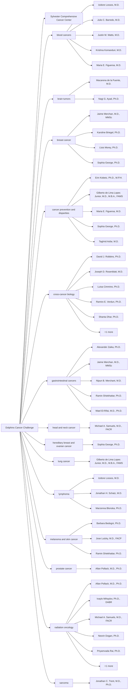

```mermaid
flowchart LR
  DCC[Dolphins Cancer Challenge] --> Sylvester[Sylvester Comprehensive Cancer Center]
  DCC --> A0[blood cancers]
  A0 --> A0R0[Izidore Lossos, M.D.]
  A0 --> A0R1[Julio C. Barredo, M.D.]
  A0 --> A0R2[Justin M. Watts, M.D.]
  A0 --> A0R3[Krishna Komanduri, M.D.]
  A0 --> A0R4[Maria E. Figueroa, M.D.]
  DCC --> A1[brain tumors]
  A1 --> A1R0[Macarena de la Fuente, M.D.]
  A1 --> A1R1[Nagi G. Ayad, Ph.D.]
  DCC --> A2[breast cancer]
  A2 --> A2R0[Jaime Merchan, M.D., MMSc]
  A2 --> A2R1[Karoline Briegel, Ph.D.]
  A2 --> A2R2[Lluis Morey, Ph.D.]
  A2 --> A2R3[Sophia George, Ph.D.]
  DCC --> A3[cancer prevention and disparities]
  A3 --> A3R0[Erin Kobetz, Ph.D., M.P.H.]
  A3 --> A3R1[Gilberto de Lima Lopes Junior, M.D., M.B.A., FAMS]
  A3 --> A3R2[Maria E. Figueroa, M.D.]
  A3 --> A3R3[Sophia George, Ph.D.]
  A3 --> A3R4[Taghrid Asfar, M.D.]
  DCC --> A4[cross-cancer biology]
  A4 --> A4R0[David J. Robbins, Ph.D.]
  A4 --> A4R1[Joseph D. Rosenblatt, M.D.]
  A4 --> A4R2[Luisa Cimmino, Ph.D.]
  A4 --> A4R3[Ramiro E. Verdun, Ph.D.]
  A4 --> A4R4[Shanta Dhar, Ph.D.]
  A4 --> A4More[+1 more]
  DCC --> A5[gastrointestinal cancers]
  A5 --> A5R0[Alexander Zaika, Ph.D.]
  A5 --> A5R1[Jaime Merchan, M.D., MMSc]
  A5 --> A5R2[Nipun B. Merchant, M.D.]
  A5 --> A5R3[Ramin Shiekhattar, Ph.D.]
  A5 --> A5R4[Wael El-Rifai, M.D., Ph.D.]
  DCC --> A6[head and neck cancer]
  A6 --> A6R0[Michael A. Samuels, M.D., FACR]
  DCC --> A7[hereditary breast and ovarian cancer]
  A7 --> A7R0[Sophia George, Ph.D.]
  DCC --> A8[lung cancer]
  A8 --> A8R0[Gilberto de Lima Lopes Junior, M.D., M.B.A., FAMS]
  DCC --> A9[lymphoma]
  A9 --> A9R0[Izidore Lossos, M.D.]
  A9 --> A9R1[Jonathan H. Schatz, M.D.]
  A9 --> A9R2[Marzenna Blonska, Ph.D.]
  DCC --> A10[melanoma and skin cancer]
  A10 --> A10R0[Barbara Bedogni, Ph.D.]
  A10 --> A10R1[Jose Lutzky, M.D., FACP]
  A10 --> A10R2[Ramin Shiekhattar, Ph.D.]
  DCC --> A11[prostate cancer]
  A11 --> A11R0[Allan Pollack, M.D., Ph.D.]
  DCC --> A12[radiation oncology]
  A12 --> A12R0[Allan Pollack, M.D., Ph.D.]
  A12 --> A12R1[Ivaylo Mihaylov, Ph.D., DABR]
  A12 --> A12R2[Michael A. Samuels, M.D., FACR]
  A12 --> A12R3[Nesrin Dogan, Ph.D.]
  A12 --> A12R4[Priyamvada Rai, Ph.D.]
  A12 --> A12More[+1 more]
  DCC --> A13[sarcoma]
  A13 --> A13R0[Jonathan C. Trent, M.D., Ph.D.]
```
