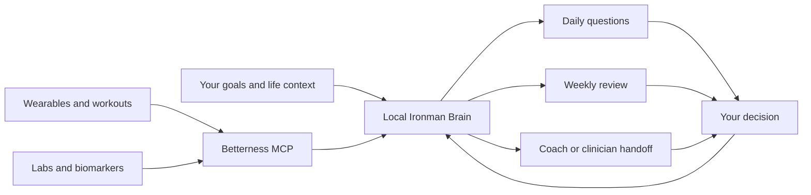

# Ironman Brain

Your local context system for endurance, recovery, health, and the life around
the training.

## Navigate

- [[00-start-here/START-HERE|Start here]]
- [[01-athlete-context/ATHLETE-PROFILE|Athlete profile]]
- [[01-athlete-context/INTERVIEW-ME|Run the context interview]]
- [[02-training-loop/DAILY-CHECK-IN|Daily check-in]]
- [[02-training-loop/WEEKLY-REVIEW|Weekly review]]
- [[02-training-loop/RACE-BLOCK|Race block]]
- [[03-data-and-mcp/BETTERNESS-MCP|Connect Betterness]]
- [[03-data-and-mcp/CAPABILITY-MAP|Available data]]
- [[04-handoffs/COACH-CLINICIAN-BRIEF|Coach or clinician brief]]
- [[templates/DAILY-NOTE-TEMPLATE|Daily note template]]
- [[templates/WEEKLY-REVIEW-TEMPLATE|Weekly review template]]
- [[templates/RACE-REVIEW-TEMPLATE|Race review template]]
- [[PRIVACY-AND-SAFETY|Privacy and safety]]

> [!tip] The operating idea
> Context first. Data second. Interpretation third. A human decision last.

## The Loop

The vault improves through explicit updates. It does not silently rewrite your
history or treat a new wearable score as truth.
